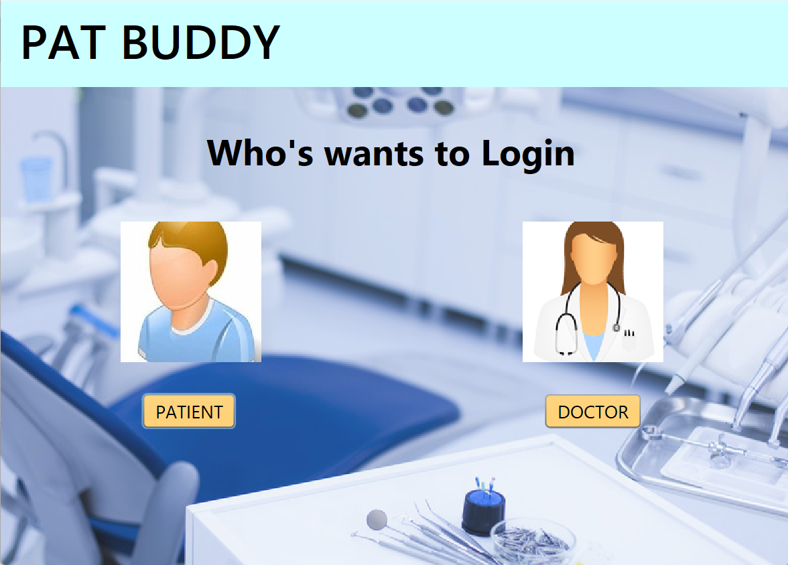
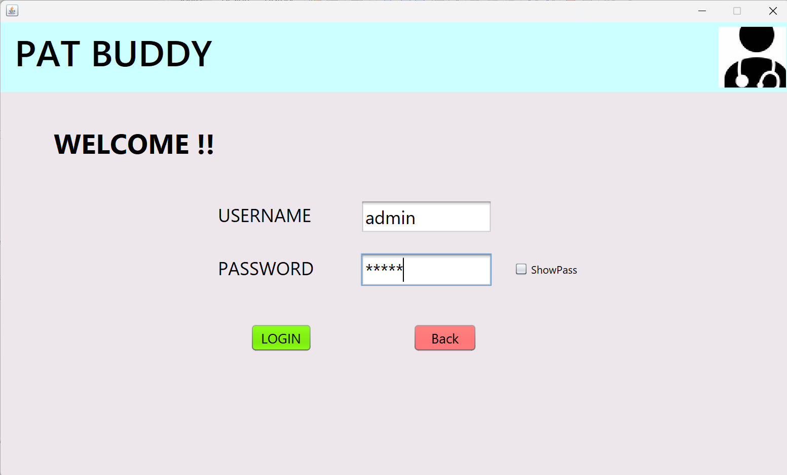
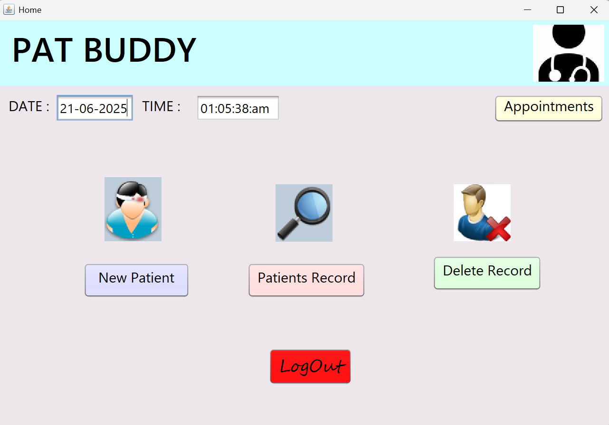

# 🏥 Clinic Management System

A Java Swing-based desktop application designed to streamline clinic operations such as patient management, appointment bookings, and medical record keeping. Built in **NetBeans** with **MySQL** backend.

---

## ✨ Features

- ✅ Patient login and signup system  
- 📅 Appointment booking interface  
- 🗂️ Patient medical record storage  
- 🕒 Real-time date & time display  
- 🌐 Online MySQL database integration  
- 🔐 Secure JDBC-based authentication  

---

## 🛠️ Tech Stack

| Layer            | Technology              |
|------------------|--------------------------|
| Frontend         | Java Swing (GUI)         |
| Backend          | Java (JDBC)              |
| IDE              | NetBeans IDE             |
| Database         | MySQL (FreeSQLDatabase.com) |
| Connector        | MySQL Connector/J        |

---

## ▶️ How to Run

1. **Clone or Download** the repository  
   ```bash
   git clone https://github.com/your-username/clinic-management-system.git
   ```
   Import Project into NetBeans (or open directly if already a NetBeans project)
   
   Set Up Database
   
   Import the clinic_db.sql file into your MySQL server (e.g., using phpMyAdmin or MySQL Workbench)
   
   Use FreeSQLDatabase.com or local MySQL for hosting
   
   Update the DB credentials in DBConnection.java:
   
   ```java
   String url = "jdbc:mysql://yourhost:3306/yourdbname";
   String username = "yourUsername";
   String password = "yourPassword";
   ```
   Build & Run
   
   Run the project using the Run button in NetBeans
   
   Or generate a .jar file and run with:
   
   ```bash
   java -jar dist/ClinicManagementSystem.jar
   ```
## 📸 Screenshots

### 📅 Home Page


### 🔐 Login Screen


### 🏥 Dashboard


## 🧑‍💻 Author
## Keshav
📧 e23cseu1538@bennett.edu.in
📍 Bennett University

## 📜 License
This project is licensed under the MIT License – feel free to use, modify, and share with attribution.

## Made with ❤️ in Java Swing
