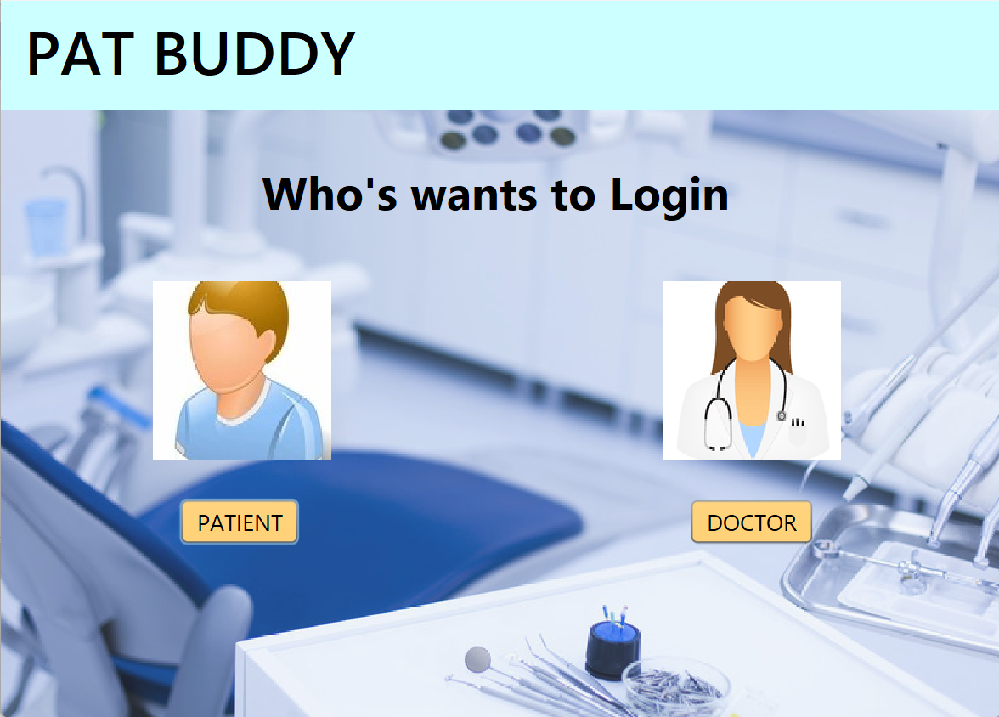
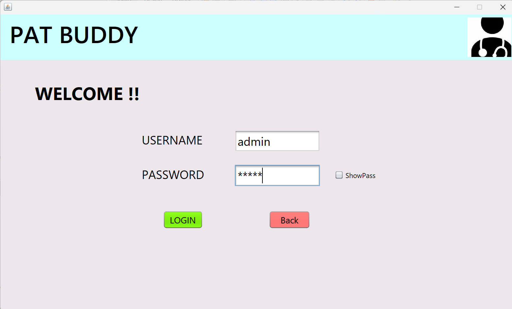
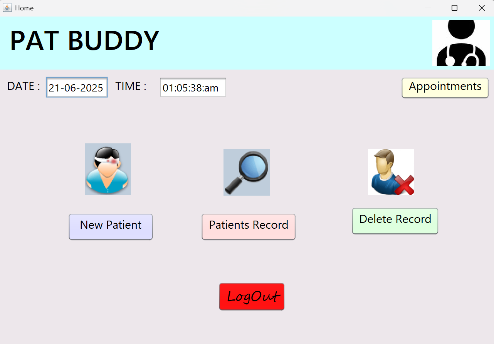

# 🏥 Clinic Management System

<p align="left">
A desktop application built using <b>Java Swing</b> and <b>MySQL</b> to streamline clinic operations such as patient management, appointment scheduling, and medical record tracking.
</p>

<p align="center">


</p>

---

# 📌 Overview

The **Clinic Management System** is a desktop-based healthcare management application designed to simplify daily clinic operations.

It provides a centralized interface for managing **patients, appointments, and medical records**, replacing traditional paper-based systems with a digital solution.

This project was developed as an academic exercise to explore **Java GUI development, database connectivity using JDBC, and CRUD-based application design**.

---

# ✨ Features

### 👤 Patient Management

* Patient login and signup system
* Patient profile and medical history tracking
* Secure user authentication

---

### 📅 Appointment Scheduling

* Book clinic appointments
* Store appointment details
* Track appointment status

---

### 🗂 Medical Record Storage

* Store patient health information
* Maintain organized patient history
* Retrieve medical records quickly

---

### ⏱ Real-Time System Information

* Displays current **date and time** inside the application
* Improves workflow tracking

---

### 🌐 Database Integration

* MySQL database backend
* JDBC-based connection system
* Online database hosting supported

---

# 🛠 Technology Stack

| Layer                 | Technology                    |
| --------------------- | ----------------------------- |
| Programming Language  | Java                          |
| GUI Framework         | Java Swing                    |
| Database              | MySQL                         |
| Database Connectivity | JDBC                          |
| IDE                   | NetBeans                      |
| Database Hosting      | FreeSQLDatabase / Local MySQL |

---

# 📂 Project Structure

```
ClinicManagement/
│
├── src/                     # Java source code
├── assets/                  # UI images and resources
├── database_schema.sql      # Database schema
│
├── build.xml                # NetBeans build configuration
├── manifest.mf
├── README.md
```

---

# ▶️ Running the Project

### 1️⃣ Clone the Repository

```bash
git clone https://github.com/your-username/clinic-management-system.git
```

---

### 2️⃣ Import Project in NetBeans

Open **NetBeans IDE**

```
File → Open Project → Select ClinicManagement
```

---

### 3️⃣ Setup the Database

Import the SQL file into MySQL using **phpMyAdmin or MySQL Workbench**.

```
database_schema.sql
```

You can use either:

* **FreeSQLDatabase.com**
* **Local MySQL (XAMPP / MySQL Server)**

---

### 4️⃣ Configure Database Connection

Update database credentials in:

```
DBConnection.java
```

Example configuration:

```java
String url = "jdbc:mysql://localhost:3306/clinic_management";
String username = "yourUsername";
String password = "yourPassword";
```

---

### 5️⃣ Run the Application

Run the project directly from **NetBeans**.

Or build a JAR file and run:

```bash
java -jar dist/ClinicManagementSystem.jar
```

---

# 📸 Screenshots

### 🏠 Home Page



---

### 🔐 Login Screen



---

### 📊 Dashboard



---

# 💡 Learning Objectives

This project demonstrates:

* Java Swing GUI development
* JDBC database connectivity
* CRUD operations with MySQL
* Desktop application architecture
* Client-database interaction

---

# 👨‍💻 Author

**Keshav Verma**
B.Tech CSE – Bennett University

📧 [e23cseu1538@bennett.edu.in](mailto:e23cseu1538@bennett.edu.in)

🔗 LinkedIn
[https://www.linkedin.com/in/keshav262004](https://www.linkedin.com/in/keshav262004)

---

# 📜 License

This project is licensed under the **MIT License**.

You are free to **use, modify, and distribute** this project with proper attribution.

---

⭐ If you find this project useful, consider giving it a **star on GitHub**.

---